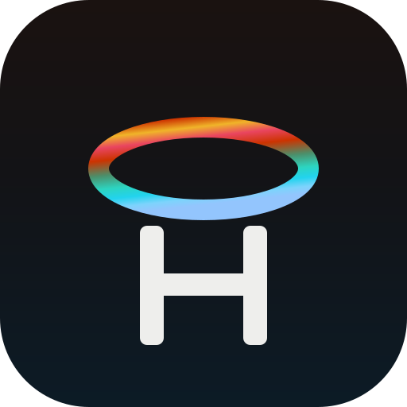
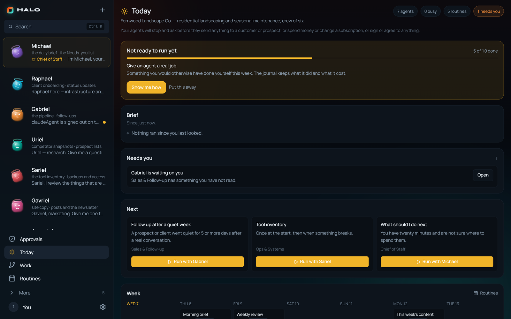
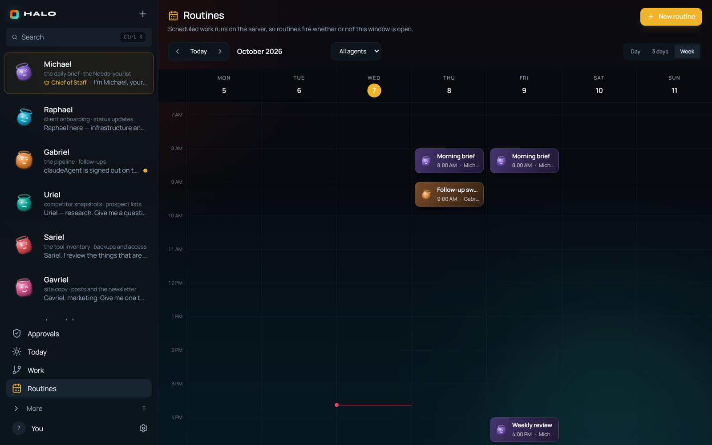
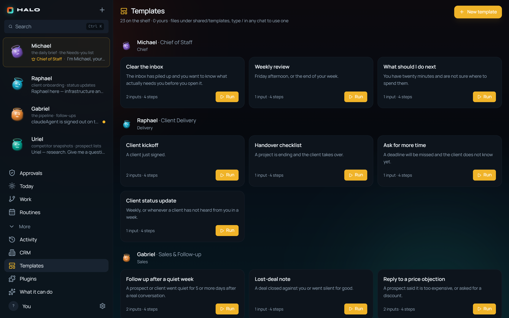
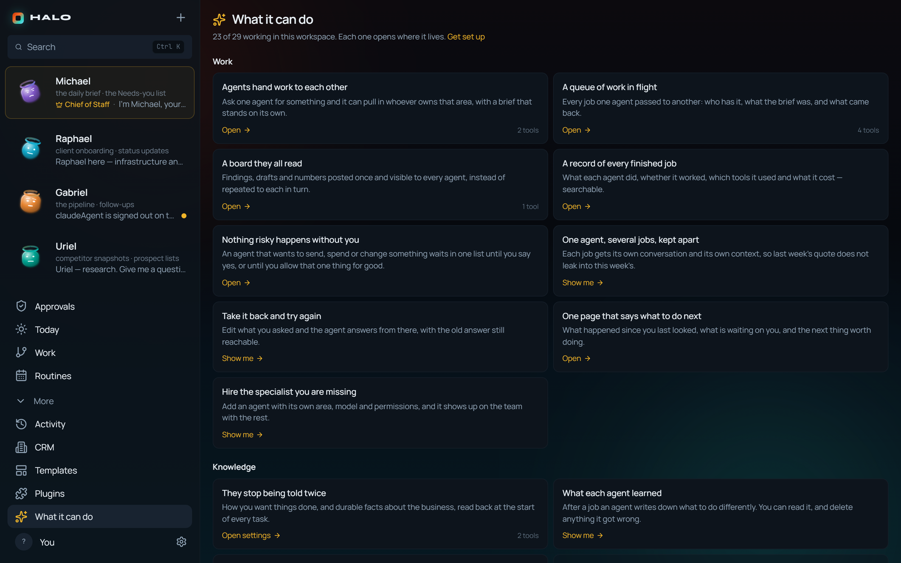
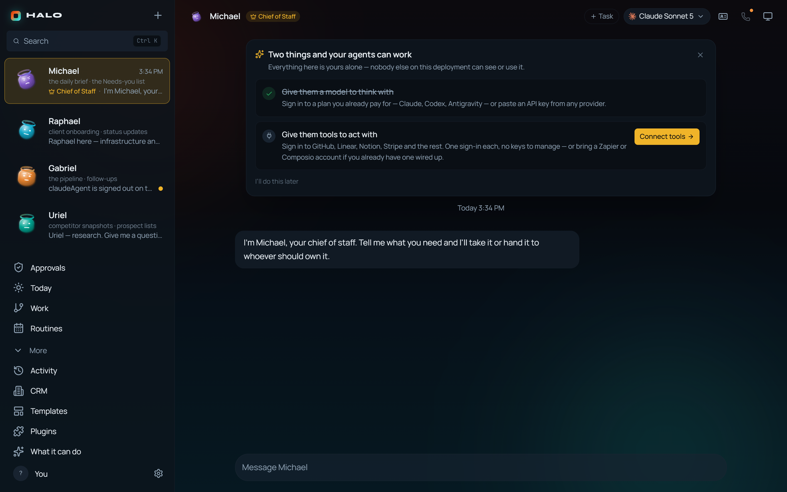
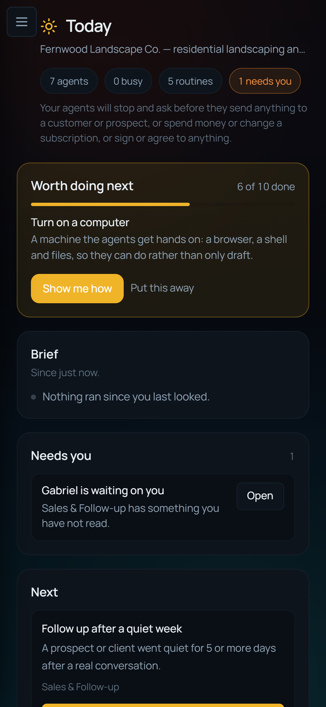
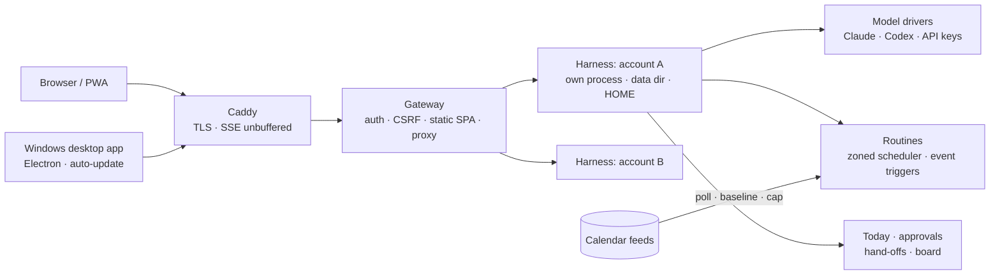

# HALO Agent OS

**A hosted operating system for a one-person business, staffed by AI agents.** Answer six
questions about the business and HALO hires the departments, puts their routines on a
calendar, stocks a shelf of templates, and opens on a home screen that says what needs you.

**Live at [haloagent.tech](https://haloagent.tech)** · Windows desktop app (x64 and Arm64)
with auto-update · source is private.

Every screen here is a local run with a fictional business, "Fernwood Landscape Co.". No
customer data.

## The problem

Agent apps hand you an empty chat box and wait. A solo owner doesn't need another thing to
prompt. They need the work a small company's staff would do anyway (follow-ups, the morning
brief, invoices, the weekly review) to happen on schedule, and to be asked before anything
leaves the building.

## What it does

| | |
|---|---|
| **Intake → a staffed company** | Six questions: what you do, where customers come from, which tools you use, what drains you, what a good month looks like, and what an agent must never do without asking. The answers become 7 departments, 5 routines, 23 templates and pinned notes. Running it again changes nothing. |
| **Today** | The home screen, computed from state with **no model call**: a brief of what ran since you last looked, one ranked Needs-you list, three suggested next jobs, and the week ahead. |
| **Routines that run on the server** | Scheduled in the owner's time zone, not the server's, and they fire whether or not a window is open. Event routines fire when something happens, such as a calendar entry about to start, exactly once per item, even across a restart. |
| **Approvals** | Agents stop and ask before they send, spend, publish, delete or sign, according to the owner's own policy. Text from outside the workspace (a calendar invite, a message) enters a prompt fenced and labelled as data, never as an instruction. |
| **Hand-offs and a shared board** | Ask one agent for something outside its area and it passes the job to whoever owns it. Findings go on one board every agent reads. |
| **Calls** | Talk to an agent or a whole room out loud: on-device dictation, replies in an ElevenLabs voice, and tool activity narrated so a long run doesn't sound like a dropped call. |
| **Bring your own model** | Each account signs in to a plan it already pays for (Claude, Codex) or pastes an API key. |

## How it works

**Accounts are isolated by process, not by careful code.** The engine underneath was built
single-user: module-level data paths, one global store, one event stream to every socket.
Rather than thread an account id through all of that, the gateway runs one harness process
per account, each with its own data directory and its own `$HOME`. A cross-account leak is
impossible by construction, and because each harness has its own `$HOME`, each subscriber's
own model CLI login stays theirs. The cost is about 80–150 MB of memory per running account,
so idle harnesses are stopped and routines wake them back up.

**No self-serve signup route.** There's nothing to attack there. Account status is the only
thing the gateway checks, so billing only has to flip that one field.

## Built with

TypeScript · React 19 · Vite 7 · Tailwind 4 · Node (type-stripped TypeScript on the server) ·
Electron · Vitest · Docker · Caddy. A 9 KB C# helper wraps Windows speech recognition behind
the same session contract as the macOS one.

## By the numbers

| | |
|---|---|
| Tests | **3,567** passing across 264 files (measured 2026-09-10) |
| Production check | **117** assertions against the live deployment after every deploy |
| Latest release | **0.2.5** (2026-09-11), Windows x64 + Arm64 |
| Commits | 912, of which 680 are Dime Data's; the rest are the upstream project's |

Token and accuracy figures are published, with methods and dates, on the
[benchmarks page](https://haloagent.tech/benchmarks.html).

## Read the code

[`excerpts/`](excerpts) has three files from the private source: zone-safe wall-clock
scheduling, the event prompt that fences outside text as data, and the Today screen's
ranking.

## Credits

HALO Agent OS is a fork of [OpenMausBot](https://github.com/milind-soni/OpenMausBot)
(originally OpenGrokBot) by Milind Soni and the OpenMausBot contributors, used under the MIT
Licence. Their licence and copyright notice ship with every build. Dime Data turned it from a
local-first desktop app into a hosted, multi-account platform.

## Status

Live and in active development. The source is private; this repository is a showcase.
© 2026 Dime Data, all rights reserved (see [LICENSE](LICENSE)). Built by
[Dime Data](https://dimedata.cloud).
